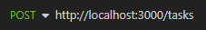
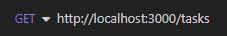
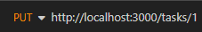
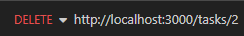

# Gerenciador de Tarefas API

Esta é uma API REST que permite os usuários criarem, listarem, atualizarem e excluirem tarefas. Cada tarefa deverá ter um título, uma descrição, uma data de vencimento e um status.
  </p>

## Linguagens e Ferramentas

- JavaScript
- Node.JS
- Insomnia
- Visual Studio Code

## Fucionalidades do Projeto

- [x] Criar tarefa
- [x] Listar as tarefas
- [x] Mostrar uma determinada tarefa
- [x] Atualizar uma tarefa
- [x] Excluir uma tarefa

## Contribua com o projeto

- Realize o Fork
- Faça as modificações necessárias
- Realize a Pull Request (PR)

## Rodando o Projeto

### Pré-requisitos

- [Git](https://git-scm.com)
- [Node.js](https://nodejs.org/en/)
- [VSCode](https://code.visualstudio.com/)
- [Insomnia](https://insomnia.rest/download)

## Rodando a API

#### No VS Code

```shell


# 1. Clone o projeto

git clone git@github.com:samuelrosaarruda/SA-Tasks.git

# 2. Instale as dependências

npm install

# 3. Inincie o servidor

npm run dev

```

## Endpoints

#### No Insomnia

#### Rotas no Insomnia

- 
- 
- 
- 
- 

#### Detalhe de cada rota

- #### POST /tasks - Criar Tarefa

<p>
Esta rota fara o registro da tarefa. O corpo da requisição (body) deve ser preenchido da seguinte maneira:

```javascript
{
"titulo": "Visitar a mãe", 
"descricao": "Comprar as passagens para vistar a mãe nessa semana",
"dataVencimento": "16/10/2023", 
"statusDaTarefa": "Finalizado" 
}
```

#### Exemplos de respostas

Caso haja sucesso na criação da tarefa, ira aparecer o seguinte resultado:

```javascript
// HTTP Status 204*
// Sem conteúdo no corpo (body) da resposta
```

Caso haja informações vazias no corpo da requsição, ira aparecer o seguinte resultado:

```javascript
// HTTP Status 400
{ "mensagem": "Titulo, descrição, data de vencimento e status da tarefa, são obrigatórios." }
```

Caso já exista uma tarefa com o titulo solicitado, ira aparecer o seguinte resultado:

```javascript
// HTTP Status 400
{"mensagem": "Já existe uma tarefa com este titulo (Limpar Casa), por favor insira uma nova tarefa ou exclua a presente tarefa."}
```

- #### GET /tasks - Listar Tarefas

<p>
Esta rota ira listar as tarefas registradas. Não terá resposta no corpo (body) da requisição.

#### Exemplo de resposta

Ira aparecer o seguinte resultado:

```javascript
// HTTP Status 200
[
 {
  "id": 1,
  "titulo": "Levar a Nami no veterinario ",
  "descricao": "Levar a Nami para um banho e tosa no veterinario.",
  "dataVencimento": "20/10/2023",
  "statusDaTarefa": "Não iniciado"
 }
]
```

- #### GET /tasks/id - Detalhar Tarefa

<p>
Esta rota ira detalhar uma tarefa expecifica, basta inserir o ID na barra de pesquisa da tarefa desejada.(Conforme imagem acima)

#### Exemplos de respostas

Caso seja encontrado a tarefa no corpo da respota (body), ira aparecer o seguinte resultado:

```javascript
// HTTP Status 200
{
 "id": 2,
 "titulo": "Visitar a mãe",
 "descricao": "Comprar as passagens para vistar a mãe nessa semana",
 "dataVencimento": "16/10/2023",
 "statusDaTarefa": "Finalizado"
}
```

Caso o id não seja informado, ira aparecer o seguinte resultado:

```javascript
// HTTP Status 400
{ "mensagem": "Para encontrar a tarefa desejada é nescessário fornecer o indentificador desta tarefa." }
```

Caso o id não seja encontrado, ira aparecer o seguinte resultado:

```javascript
// HTTP Status 404
{"mensagem": "A tarefa solicilita no indentidicador passado, não foi encontrada."}
```

- #### PUT /tasks/id - Atualizar Tarefa

<p>
Esta rota ira atualizar uma tarefa expecifica, para realizar esta atualização é nescessário fornecer o ID da tarefa (Conforme a imagem acima) e fornecer as informaçôes no corpo da requisição, peenchendo os campos titulo, descricao, dataVencimento, statusDaTarefa, conforme exemplo abaixo:

```javascript
{
"titulo": "Levar a Nami no veterinario ", 
"descricao": "Levar a Nami para um banho e tosa no veterinario.",
"dataVencimento": "20/10/2023", 
"statusDaTarefa": "Não iniciado" 
}
```

#### Exemplos de respostas

Caso haja sucesso na atualização da tarefa, ira aparecer o seguinte resultado:

```javascript
// HTTP Status 204*
// Sem conteúdo no corpo (body) da resposta
```

Caso o id não seja informado, ira aparecer o seguinte resultado:

```javascript
// HTTP Status 400
{ "mensagem": "Para encontrar a tarefa desejada é nescessário fornecer o indentificador desta tarefa." }
```

Caso o id não seja encontrado, ira aparecer o seguinte resultado:

```javascript
// HTTP Status 404
{"mensagem": "A tarefa solicilita no indentidicador passado, não foi encontrada."}
```

Caso haja informações vazias no corpo da requsição, ira aparecer o seguinte resultado:

```javascript
// HTTP Status 400
{ "mensagem": "Titulo, descrição, data de vencimento e status da tarefa, são obrigatórios." }
```

Caso já exista uma tarefa com o titulo solicitado, ira aparecer o seguinte resultado:

```javascript
// HTTP Status 400
{"mensagem": "Já existe uma tarefa com este titulo (Limpar Casa), por favor insira uma nova tarefa ou exclua a presente tarefa."}
```

- #### DELETE /tasks/id - Excluir Tarefa

<p>
Esta rota ira remover uma tarefa da lista de tarefas, atravez do ID da tarefa desejada (Conforme a imagem acima).

#### Exemplos de respostas

Caso haja sucesso na atualização da tarefa, ira aparecer o seguinte resultado:

```javascript
// HTTP Status 204*
// Sem conteúdo no corpo (body) da resposta
```

Caso o id não seja informado, ira aparecer o seguinte resultado:

```javascript
// HTTP Status 400
{ "mensagem": "Para encontrar a tarefa desejada é nescessário fornecer o indentificador desta tarefa." }
```

Caso o id não seja encontrado, ira aparecer o seguinte resultado:

```javascript
// HTTP Status 404
{"mensagem": "A tarefa solicilita no indentidicador passado, não foi encontrada."}
```

##### *Para ver o resultado das rotas Criar Tarefa, Atualizar Tarefa e Excluir Tarefa, utilize a rota Listar Tarefas

## Autor

<a href="https://github.com/samuelrosaarruda">
 
 <br />
 <sub><b>Samuel da Rosa Arruda</b></sub></a>
 <br />
